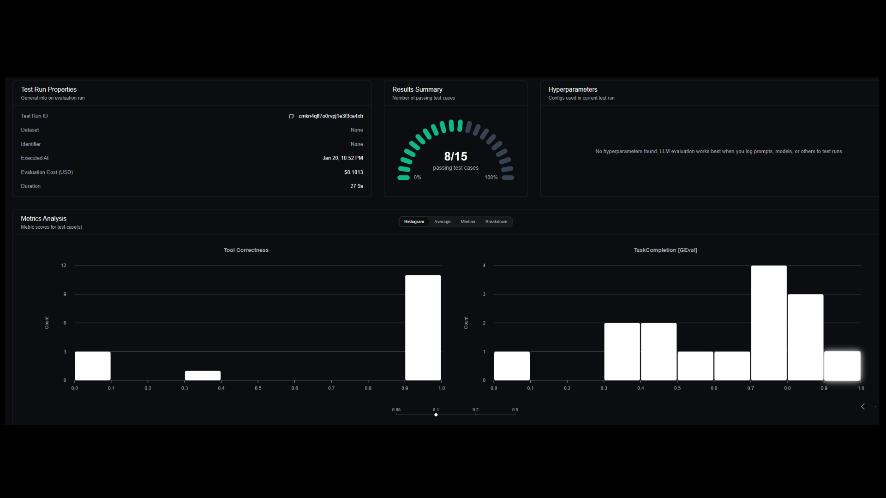

# 🍽️ FoodLooker

**AI-Powered Restaurant Reservation Agent**

An intelligent agent that searches, filters, and books restaurants autonomously — so you don't have to lift a finger.

> 🎓 Master's Thesis Project | Master in Engineering of Generative AI Solutions @ EBIS Business Techschool | Grade: 10/10
DEMO Video:
[](https://www.youtube.com/watch?v=v7iGPF_20dk)

---

## 🎯 The Problem

Traditional reservation flows are fragmented: you search on Google, check availability on another app, call if there's no online booking, and manually add it to your calendar. Most LLM-based solutions are linear and brittle — they break when facing uncertainty or unavailability.

## 💡 The Solution

FoodLooker is not a chatbot. It's an **autonomous agent** capable of reasoning, adapting, and executing across multiple modalities to guarantee the reservation gets done.

With a simple phrase like:

> *"Book me a table at X restaurant for dinner at 9pm for 3 people"*


The agent will:
1. Search the restaurant on Google Maps
2. Verify availability via API
3. If no API exists → **make a real phone call** with a human-like synthetic voice
4. Confirm and add the reservation to your personal calendar


---

## 🏗️ Architecture

The system implements a **ReAct (Reason + Act) cognitive loop**, allowing the agent to think before acting, observe results, and adapt its strategy dynamically.


**Core Components**

| Layer | Technology | Purpose |
|-------|------------|---------|
| **Frontend** | Streamlit | User interaction interface |
| **API REST** | FastAPI | Conection between frontend and backend |
| **Backend** | LangChain + LangGraph | LLM integration and Agent Orchestration as a dynamic state graph |
| **Tools** | Tavily Web Search, Google Places, Twilio + ElevenLabs, Google Calendar | Perception and execution |
| **Observability and Evaluation** | LangSmith, DeepEval | Tracing and evaluation |


## 🔧 AI Agent Tools

The agent is equipped with a set of specialized tools that enable perception, action, and integration with external services:

| Tool | Description |
|------|-------------|
| **Tavily Web Search** | Performs real-time web searches to gather information about restaurants, reviews, and general context |
| **Google Places API** | Searches and retrieves detailed restaurant data: location, ratings, opening hours, contact information |
| **Twilio + ElevenLabs** | Multimodal fallback system. ElevenLabs generates hyper-realistic synthetic voice; Twilio handles real-time phone calls to restaurants without digital booking systems |
| **Google Calendar API** | Automatically creates calendar events once a reservation is confirmed |
| **Mock CoverManager** | Simulated the booking process througth API Services of Covermanager |


## 📊 Observability & Evaluation (LLMOps)

### Tracing with LangSmith

Full visibility into the agent's reasoning: every thought, action, tool call, and response.


### Evaluation with DeepEval

The project includes an evaluation system based in LLM-as-a-judge using [DeepEval](https://deepeval.com/) powered by Confident AI.

| Metric | Description |
|--------|-------------|
| **Tool Correctness** | Is the AI Agent selecting and using the appropriate tool for each step? |
| **Task Completion** | Does the agent successfully complete the user's requested task? |
| **Response Quality** | Are the responses clear, complete, and helpful? |



---


## 📁 Project Structure

```
genai-tfm/
│
├── agent/                          # Core agent system (LangGraph + ReAct)
│   ├── graph.py                   # LangGraph orchestration and nodes
│   ├── main.py                    # Agent execution entry point (terminal)
│   ├── prompts.py                 # Prompt loader and formatter
│   ├── state.py                   # State management and data models
│   └── tools.py                   # External tools (Maps, Booking, Calendar, Phone)
│
├── backend/                        # Backend services
│   ├── calendar_tools.py          # Google Calendar integration
│   ├── call_service.py            # Twilio/ElevenLabs phone call service
│   └── google_places.py           # Google Places API integration
│
├── config/
│   └── settings.py                # Configuration loader (.env)
│
├── FastAPI/                        # API backend
│   ├── api_server.py              # FastAPI server
│   └── test_api.py                # API tests (manual)
│
├── frontend/                       # User interface
│   ├── frontend.py                # Streamlit UI
│   └── frontend_api_helpers.py    # API helper functions
│
├── prompts/                        # Prompt templates (markdown)
│   ├── agent_system_prompt.md     # Main agent system prompt
│   ├── call_script_generation.md  # Phone call script template
│   └── call_result_analysis.md    # Call result analysis template
│
├── tests/                          # Automated tests (pytest)
│   ├── conftest.py                # Shared fixtures and mocks
│   ├── unit/                      # Unit tests
│   │   ├── test_agent_graph.py   # Tests for agent graph logic
│   │   ├── test_tools.py         # Tests for agent tools
│   │   ├── test_state.py         # Tests for state management
│   │   ├── test_prompts.py       # Tests for prompt system
│   │   └── test_settings.py      # Tests for configuration
│   ├── integration/               # Integration tests
│   │   ├── test_google_places.py # Tests for Google Places API
│   │   ├── test_call_service.py  # Tests for phone call service
│   │   ├── test_calendar_tools.py# Tests for calendar integration
│   │   └── test_api_server.py    # Tests for FastAPI endpoints
│   └── fixtures/                  # Test data and mock responses
│       └── mock_responses.py     # Sample API responses for testing
│
├── evals/                          # LLM Evaluation with DeepEval
│   ├── datasets.py                # Golden test datasets for evaluation
│   ├── metrics.py                 # DeepEval metrics configuration
│   ├── run_evals.py               # Evaluation runner script
│   └── results/                   # Evaluation results output
│
├── .coveragerc                     # Coverage configuration (output to test_results/)
├── .env                            # Environment variables (API keys)
├── .env.example                    # Environment template
├── Dockerfile                      # Docker configuration
├── main.py                         # Main entry point (starts all services)
├── pytest.ini                      # Pytest configuration
├── README.md                       # Project documentation
└── requirements.txt                # Python dependencies
└── tool_description.md             # Tools available
```

---

## 🚀 Roadmap

This MVP is the foundation. Future directions include:

- [ ] **Long-term memory (RAG)**: Vector database to persist user preferences across sessions
- [ ] **Flight & hotel booking**: Expand to travel reservations
- [ ] **General errands**: "Find me a dentist appointment next week"
- [ ] **Multi-language voice**: Support for calls in different languages
- [ ] **WhatsApp integration**: Alternative channel for confirmations

## 📄 License

This repository showcases the project structure and documentation. Source code is not publicly available.


