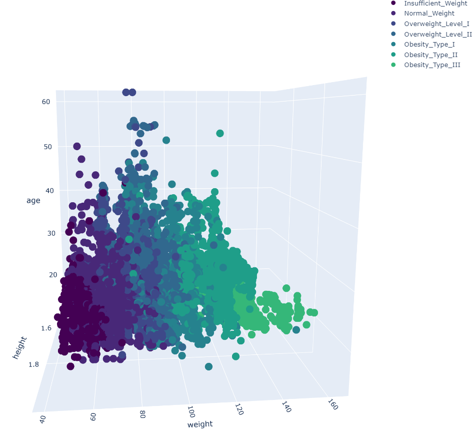
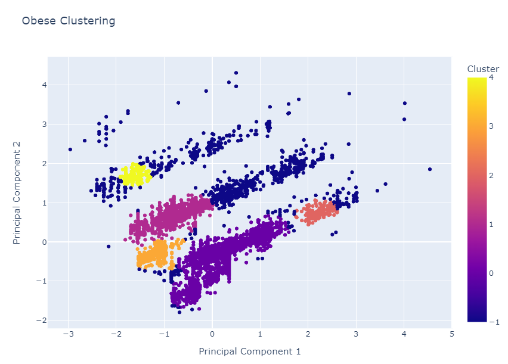
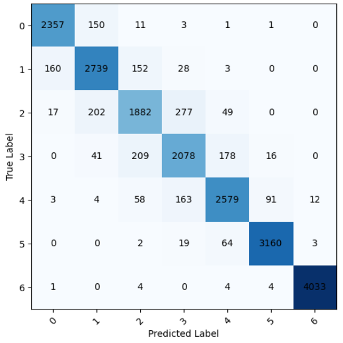

# **Predicción de Obesidad - Analisis, Clustering y Clasificacion Multiclase**

## **1. Introducción**

Este proyecto utiliza un conjunto de datos que estima los niveles de obesidad en 
personas de países como México, Perú y Colombia, con edades entre 14 y 61 años. 
El dataset incluye datos sobre hábitos alimenticios, condición física y factores relacionados 
con sus hábitos de vida.

El objetivo es utilizar técnicas **análisis de datos**, **clustering** y **clasificación** para analizar y 
predecir los niveles de obesidad en función de los diversos factores.

---

## **2. Indice Proyecto**

**1. Libraries:** instalacion bibliotecas necesarias

**2. EDA:** exploracion de los datos y columnas. Visualizacion de histogramas univariante y bivariante. 3D Scatterplots

**3. Feature Engineering:** destilacion nuevas variables basandonos en las ya existentes.

**4. Encoding categorical features.**

**5. Clustering**

**7. Classification Model:** utilizacion de LightGBM para la construccion del modelo clasificador y posterior ajuste de hiperparámetros con Optuna (Optimizacion Bayesiana). Evaluacion, resultados y model-explainability

---

## **3. Resultados**

En cuanto a los resultados del modelo, las características más importantes identificadas son la altura, el peso y la edad, aunque la relevancia de la edad puede deberse al desbalance en los datos, ya que muchos individuos con sobrepeso u obesidad son jóvenes. El modelo tiene un alto rendimiento, con un 95% de precisión general, aunque presenta menor exactitud en las categorías Overweight_type_I y Overweight_type_II. 

Sin embargo, debido a que los datos fueron generados artificialmente mediante técnicas de deep learning y contienen valores atípicos en algunas características, esta evaluación no representa una comparación completamente fiel a la realidad. Aun así, el rendimiento del modelo para este conjunto de datos es satisfactorio.

