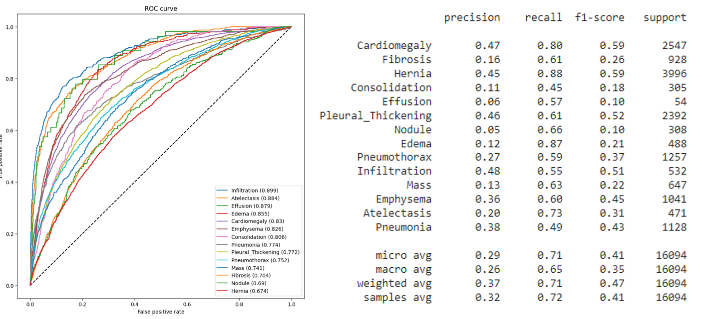
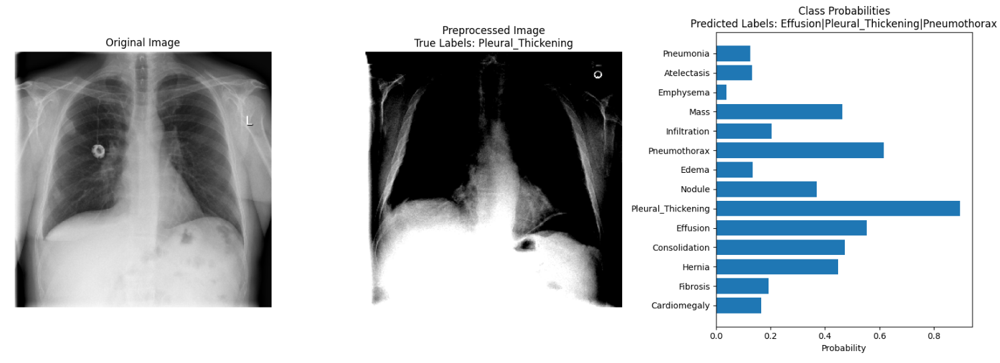
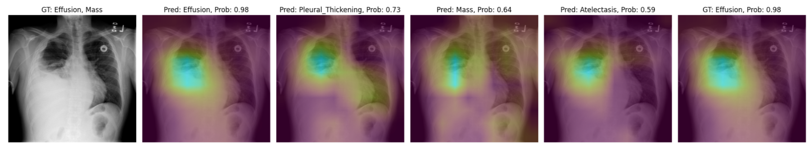

# **Medical Image Classifier using DenseNet121**

This project implements a multi-label image classification system for medical images using a **DenseNet121** architecture, pre-trained on ImageNet. 
The goal is to classify different medical conditions based on X-ray images, leveraging transfer learning techniques.

---

## **Proyect outline**

The notebook is divided in the following sections:

**Intro**: Brieg description of the data and challenges.
   
0. **Libraries**: Instalation of the needed libraries to run the notebook.
   
1. **Train / Test Split**: split the data in train, validation and test following an unique patient list. Test patients must not be present in Train split in order to avoid data leakage.
   
   
2. **Loading the data**: Use of ImageDataGenerators to load, preprocess and data augment the images into the model. Dealing with class imbalance using custom weight function loss.

   
3. **Model Built-up & Training**: Importation of DenseNet121 architecture and trainning.
    
4. **Prediction and evaluationModelado**: XGBoost Regressor y posterior optimizacion de hiperparametros con Optuna.

5. **Grad-CAM implementation**: it allows us to increase the model explainability.

---

## **Results**  
Great avg AUC performance over 0.83 in validation. Good metrics in recall but poor in precision.

