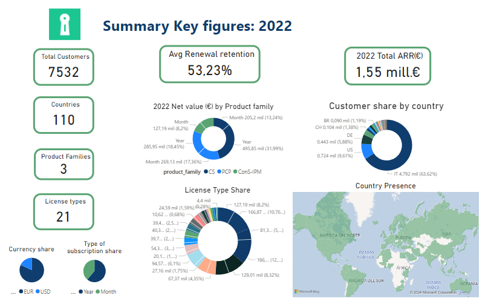
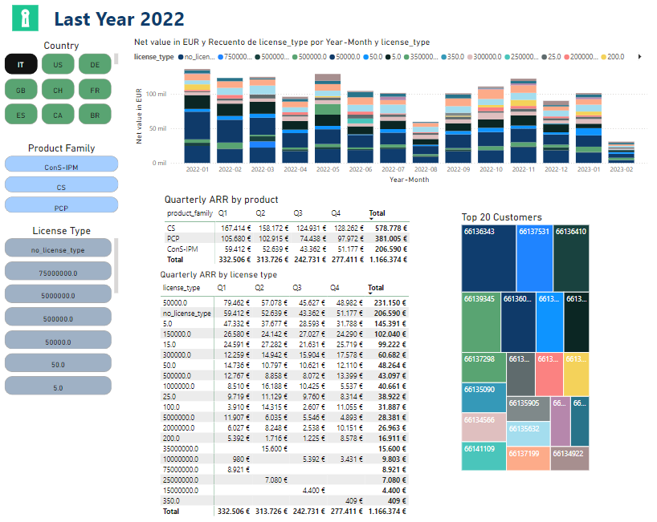
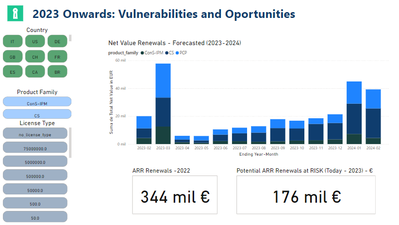

# Power BI Dashboard - Subscriptions company based

This projects is related with the [SQL project](https://github.com/alejosilvestre/Portfolio/tree/master/SQL) in this Repo. The dashboard aim is to caputure the main KPIs of the business of a certain company. 
It's global business is based on a subscription and renewal scheme offering diverse products worldwide.

The data provided and the records go from start of 2022 until end of February 2022 (22/2/2022). 
The assumption is that the analysis took place from that date onwards. After that date it's understood no new subscriptions nor renewals are made.
Data Exploration and Cleanning were made in a Python Notebook before uploading the data(.csv) into the three tables in PowerBI (Users, Subscriptions, Subscriptions_renewals)

You can download the [Dashboard](https://github.com/alejosilvestre/Portfolio/blob/master/PowerBI_dashboard/Dashboard.pbix) here!

## Dashboard Structure

### Summary
The aim of this sheet is to give a global picture of global business capturing some KPIs and business info of historical data. 

---

### Actual
Focus on the previous year(2022) and the present months of early 2023. We can analyse more in detail, products and customers

---

### Forecast

Impact of the future risks/opportunities of renewals of the ending subscriptions from prensent-onwards (until February 2024).

--- 

