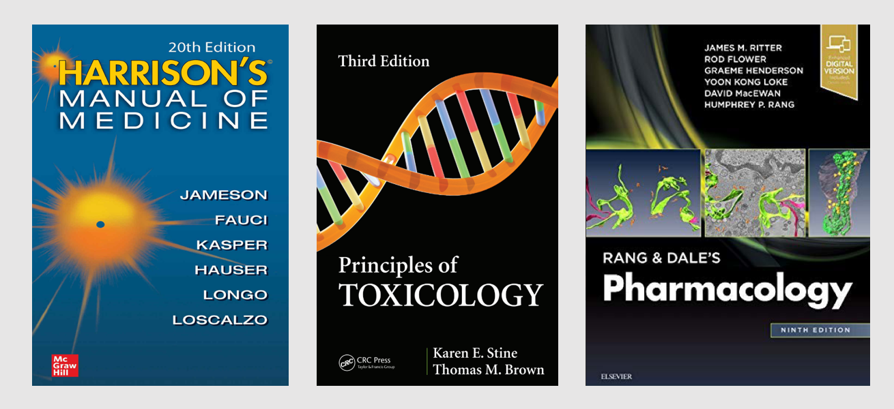
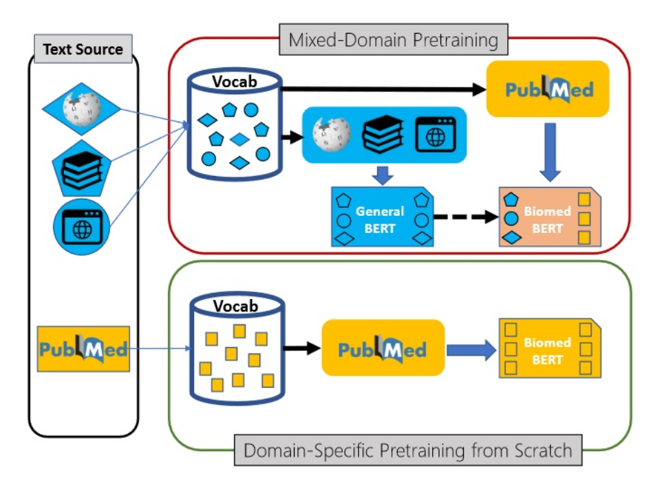
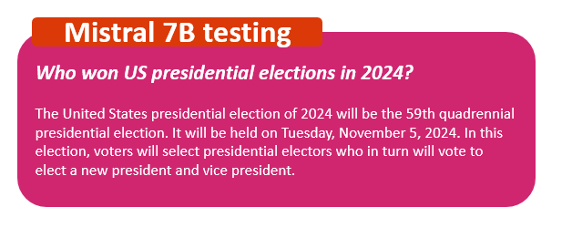
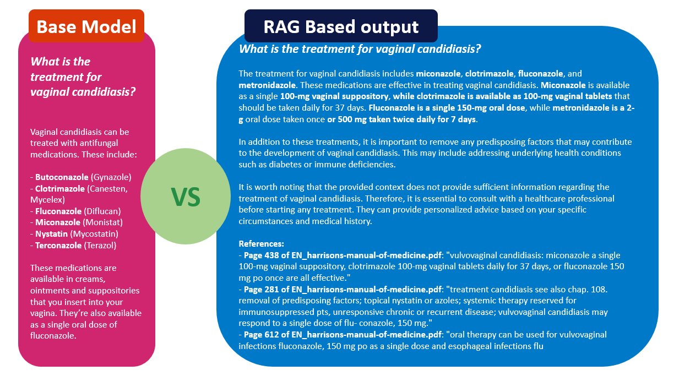

# **Biomedical RAG Chatbot - GenAI**

  

I've build this RAG chatbot to provide support to a LLM with an especific acurate context out of the training of the LLM in order the model to be able to answer new specialized questions about a certain topic.

Three books has been processed and loaded to feed the RAG system.

- **Pharmacology:** Rang & Dale's Pharmacology, 9th Edition (2020)

- **Medicine:** Harrison's Manual of Medicine, 20th Edition (2018)

- **Toxicology:** Principes of Toxicology Stine & Brown, 3rd Edition(2015)

  

**In total more than 2500 pages of an especific field information.**

---

## **Proyect outline**

The aim of creating this project was to create a specialized RAG Chatbot overcomming the challenge of answering domain-specific questions with coherence and precission.

**1. Requirements and Libraries**

**2. Document loading**: Used PyPDF to extract and convert all the information contained in the PDF files (books).

**3. Document Processing & Spliting**: Used a Semantic Chunker + RecursiveTextSplitter for the chunking generating =~ 15K Chunks

**4. Embeddings generation using Specialized Biomedical Domain Model**: Used SPubMedBert, Bert version trained specifically on PubMed Abstracts to gain the domain specific knowledge.

  

**5. RAG construction**: Used Chroma as vector-database to store all chunks embeddings.

  

**6. Building the LLM for generating the answer**: one of the latest state-of-the-art general purpose models, Mistral 7B, for the generation of the output. Training of this model was made until Sept 2023 so I do not expect it to know current information.

**7. Testing**: Generated novel information(US-Presidential elections info, Nov 24) out-of-scope of the LLM model to test the ability to answer question it truly doesn't know. Tested with a medical specific domain question to see the precision in the response.

  

**8. Building the RAG-Chain & Prompt Engineering**: Built a prompt to instruct the LLM througth the Chain to create a certain style of output.

**9. Conclusion**: Based on the executed lines the **LLM(Mistral 7B)** without the implementation of the RAG technique is not able to answer correclty the question about **US Presidential elections** as we expected but when associated with the RAG, it provide the precise and accurate answer desired proving thad the RAG is working well.

  

Regarding the medical output is yet to be determined if this is providing the correct and precise healthcare answer always, but it can search information precisely and support its response with that ''evidence'' which I believe is a much more robust answer than solely the LLM output (very imprecise and general.).

The **RAG-chain** created is able to provide **dosing and forms of application** as well as the **retrieved context** to check manually if needed giving a much more robust and precise answer.

And as in the fairy tales, this story ends. **And they lived happily ever after.**

  

Thanks for watching!

