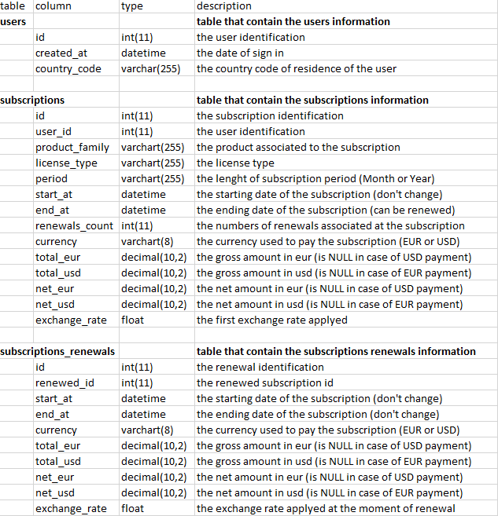
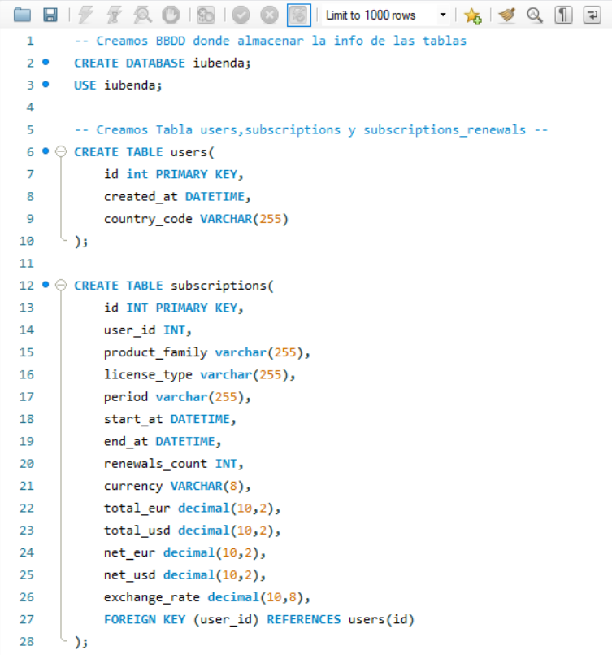
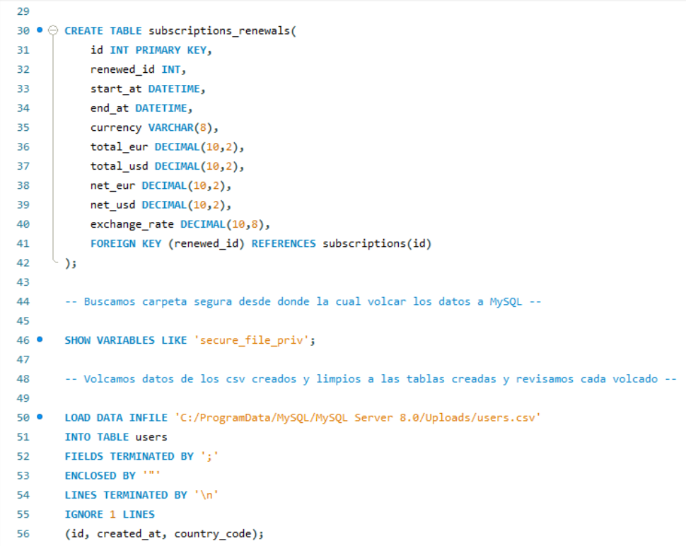
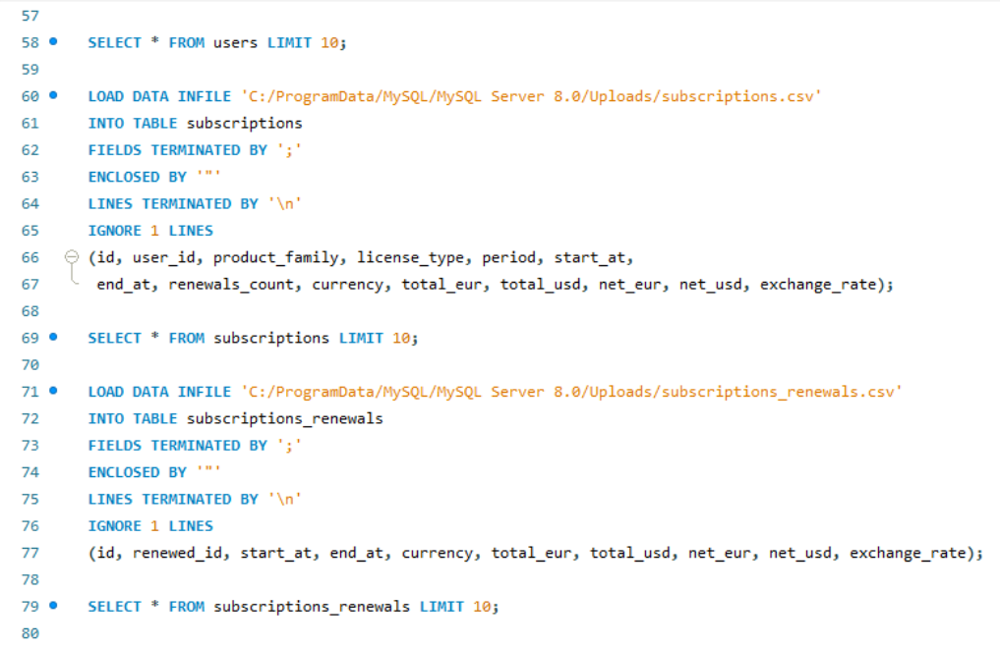
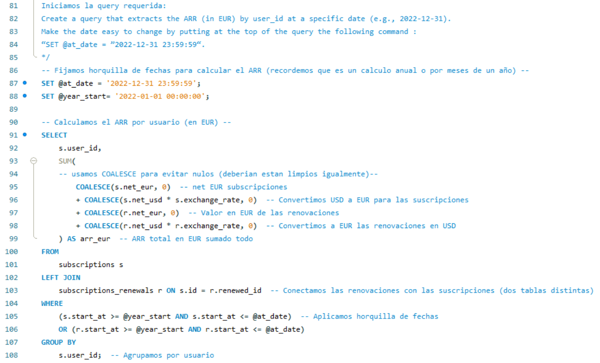
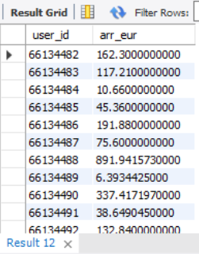

# SQL - Database creation, table connection and SQL query
This project is related with the [PowerBI Dashboard](https://github.com/alejosilvestre/Portfolio/tree/master/PowerBI_dashboard) where from a xlms file with all the raw data of business info (subscriptions) 
of certain company is treated and cleaned in a python.ipynb generating 3 diferents csv files according each one to a certain table.

Here below the metadata for the rational of everycolumn and the links between them.

From the database three tables (users, subscriptions and subscriptions_renewals) are created. Afterwards the information is loaded from CSV files
checking everything is displaying okey.

Finaly a SQL query is executed to obtain the ARR in € per user_id.

## SQL Code in MySQL Workbench

And the result of the query:

