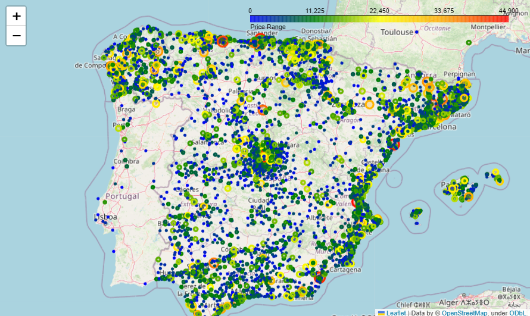

# **Car Prices Prediction - WhiteBox Datathon**

## **1. Introducción**

Este proyecto se basa de una competicion creada por WhiteBox donde el objetivo era generar un modelo capaz de predecir el precio de un coche de segunda mano basandose en distintas caracteristicas de los anuncios de coches. Los datos son real-world data. El ganador del Datathon seria el que menor RMSE tuviera.

---

## **2. Estructura del Proyecto**

El proyecto está dividido en las siguientes secciones:

1. **Introducción**: Descripción de la competición y sus objetivos.
   
2. **Librerías**: Instalación de las librerías necesarias para el análisis de datos y el entrenamiento del modelo.
   
3. **Análisis Exploratorio de Datos (EDA)**: Estudio de las distintas variables y extraccion de informacion util por medio de REGEX y API Google Maps. Correlacion variables con target.
   
4. **Visualizacion:Ingeniería de Características**:Analisis de las variables Numericas(Violin & Boxplot) , Categóricas (Histogramas) , analisis bivariante  y visializacion de la distribucion de los anuncios a nivel geografico

   
5. **Preprocesamiento**: Eliminacion de Outliers, encoding de variables categoricas y normalizacion (Robust Scaler)
    
6. **Modelado**: XGBoost Regressor y posterior optimizacion de hiperparametros con Optuna.

---

## **3. Resultados**  
- Valoración del rendimiento del modelo con los mejores hiperparametros en **local**: 2467.36
- Valores RMSE tras evaluación en **Kaggle**: 9659.89 de RMSE (ganadores 8809.43)

