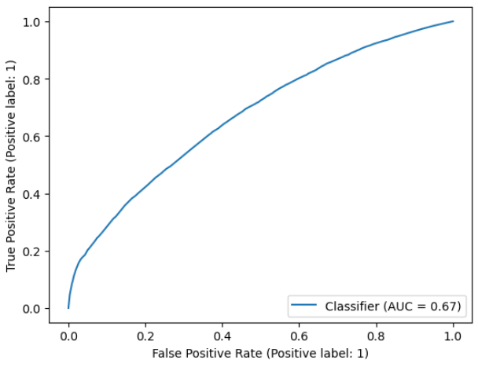
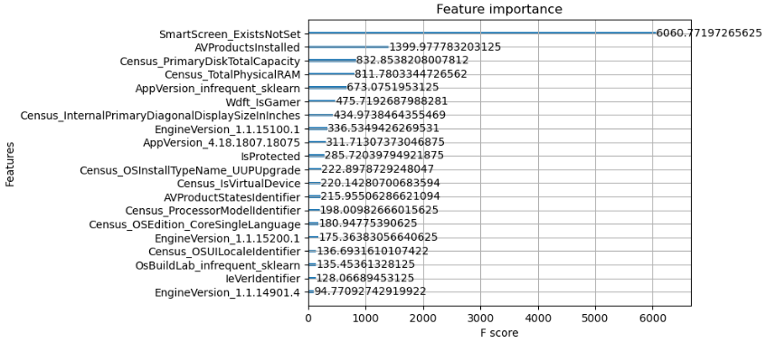

# Microsoft Malware Prediction - Binary Classificator

## **1. Introducción**
El dataset consiste en 500.000 observaciones de distintas variables (83) referentes a ordenadores. La columna target es 'HasDetections', y esto significa si está infectado por virus o no. El objetivo será **constuir un modelo que consiga predecir el mayor numero de casos de infeccion.**

## **2. Resumen operaciones y roadmap**

**ROAD MAP Y OUTLINE**: 

**1. Comprensión del problema/negocio**: Exploracion informacion columnas
    
**2. Entendimiento de los datos**: EDA univariante y multivariante, correlacion variables vs target y visualizacion distribucion de las variables numericas.
    
**3. Preprocesamiento**: asignacion tipo de dato, tratamiento de NaNs, reduccion de la dismensionalidad(eliminacion variables con mucha correlacion entre si, constantes o con excesiva fragmentacion) y codificacion de variables no-numericas (OHE). No hay escalado ya que los arbooles de decision lo soportan bien.
    
**4. Modelización**: Baseline; evaluacion en paralelo de 4 diferentes algoritmos(Random Forest, Gradient Boosting, XGBoost y Logistic_Regression)
    
**5. First Iteration**: Seleccion mejor algoritmo; XGBoost con 7 features importantes + target

**6. Second Iteration**: Lista de 3 modelos (Random Forest, Gradient Boosting y XGBoost) con 7 features + target.

**7. Third Iteration**: XGBoost optimizado con hiperparametros  y entrenado con datos ampliados (20 col + target)

## **3. Conclusiones** 

Hemos conseguido mejorar el modelo! Tanto las metricas han mejorado respecto al baseline (Recall:0.6560 vs 0.7055) como el rendimiento visualizado en la curva ROC-AUC (AUC: 0.62 vs 0.65).

