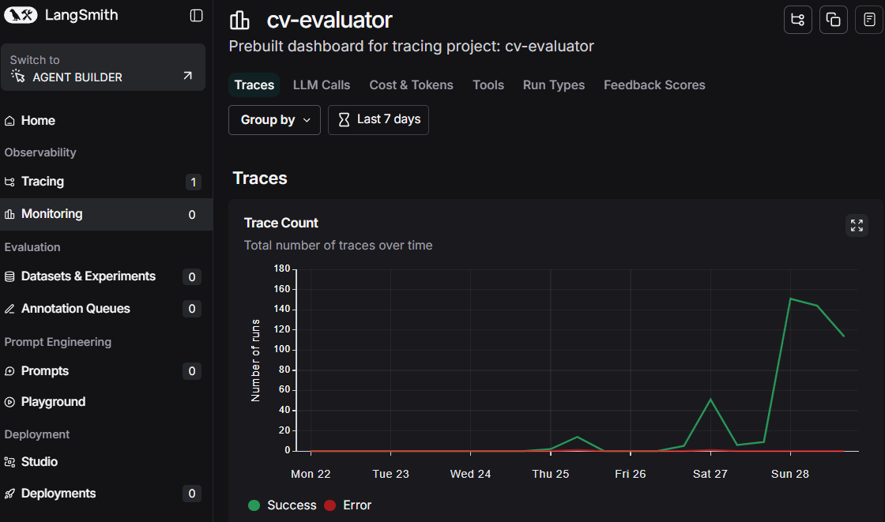
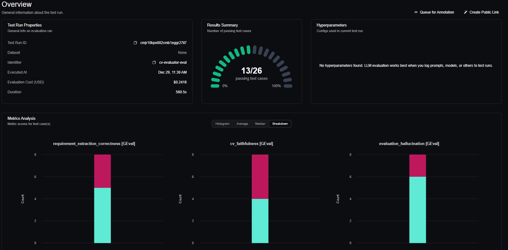
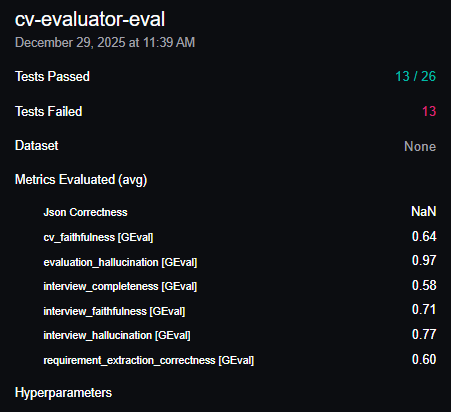

# CV Evaluator - Sistema de Evaluación de Candidatos con IA

## 📋 Descripción General

**CV Evaluator** es un sistema basado en LLMs que automatiza la evaluación de candidatos comparando sus CVs contra los requisitos de una oferta de trabajo. El sistema está construido con **LangChain** para la orquestación de LLMs, **LangSmith** para el tracking de ejecuciones, y **DeepEval** para la evaluación de calidad del sistema.


---

## 🎯 Funcionalidad Principal

El sistema opera en **dos fases**:

### Fase 1: Evaluación Automática CV-Oferta

1. **Extracción de Requisitos**: Analiza la oferta de trabajo y extrae todos los requisitos, clasificándolos como:
   - **Obligatorios**: Requisitos mínimos/imprescindibles (palabras clave: "mínimo", "requerido", "necesario")
   - **Opcionales**: Requisitos deseables (palabras clave: "valorable", "deseable", "plus")

2. **Matching CV-Requisitos**: Compara el CV del candidato contra cada requisito y los clasifica en requisitos cumplidos, no cumplidos y por determinar, los cuales el sistema preguntará al usuario por esa información faltante
 

3. **Cálculo de Puntuación**:
   - Score = (requisitos cumplidos / total requisitos) × 100
   - Si falla un requisito **obligatorio** → Candidato descartado y puntuación de 0

### Fase 2: Entrevista de Verificación

Si el candidato no está descartado y tiene requisitos por determinar:

1. **Generación de Preguntas**: El sistema genera preguntas específicas para cada requisito pendiente
2. **Procesamiento de Respuestas**: Interpreta las respuestas del candidato (confirmed/denied/unclear)
3. **Actualización de Evaluación**: Recalcula el score con la nueva información

---

## 🏗️ Arquitectura del Sistema

Si se desea entender mejor cómo se interrelacionan los distintos módulos del proyecto abrir architecture_diagram.html para ver una vision un poco más detallada y técnica del proyecto.

```
┌─────────────────────────────────────────────────────────────────────┐
│                        CV EVALUATOR SYSTEM                         │
├─────────────────────────────────────────────────────────────────────┤
│                                                                     │
│  ┌──────────────┐    ┌──────────────┐    ┌──────────────┐          │
│  │   INPUTS     │    │   CORE       │    │   OUTPUTS    │          │
│  │              │    │              │    │              │          │
│  │  • Oferta    │───▶│  LangChain   │───▶│  Evaluación  │          │
│  │  • CV        │    │  + LLM       │    │  JSON        │          │
│  └──────────────┘    └──────────────┘    └──────────────┘          │
│                             │                                       │
│                             ▼                                       │
│                    ┌──────────────┐                                 │
│                    │  LangSmith   │                                 │
│                    │  (Tracking)  │                                 │
│                    └──────────────┘                                 │
│                                                                     │
├─────────────────────────────────────────────────────────────────────┤
│                      EVALUATION LAYER                               │
│                                                                     │
│  ┌──────────────────────────────────────────────────────────────┐  │
│  │                      DeepEval                                 │  │
│  │                                                               │  │
│  │  • requirement_extraction_correctness (GEval)                │  │
│  │  • cv_faithfulness (GEval)                                   │  │
│  │  • evaluation_hallucination (GEval)                          │  │
│  │  • interview_completeness (GEval)                            │  │
│  │  • interview_faithfulness (GEval)                            │  │
│  │  • interview_hallucination (GEval)                           │  │
│  │                                                               │  │
│  └──────────────────────────────────────────────────────────────┘  │
│                             │                                       │
│                             ▼                                       │
│                    ┌──────────────┐                                 │
│                    │ Confident AI │                                 │
│                    │ (Dashboard)  │                                 │
│                    └──────────────┘                                 │
└─────────────────────────────────────────────────────────────────────┘
```

---

## 📁 Estructura del Proyecto

Estructura original del proyecto. Este repo no contiene toda la información. Toda los los scripts estan almacenados en un repo privado, contactarme si tienes curiosidad o dudas.

```
cv-evaluator/
├── config/
│   ├── prompts.py           # Archivo con los diferentes prompts para cada cadena
│   └── settings.py          # Configuración y variables de entorno
├── core/
│   ├── evaluator.py         # Lógica de evaluación CV-Oferta (Fase 1)
│   ├── llm.py               # Carga del modelo LLM
│   └── interviewer.py       # Lógica de entrevista (Fase 2)
├── models/
│   └── schemas.py        # Modelos Pydantic (EvaluationResult)
|
├── evaluation/              # Tests con DeepEval
│   ├── conftest.py          # Configuración pytest/deepeval
│   ├── test_fase1_evaluator.py
│   ├── test_fase2_end_to_end.py
│   ├── data/                # CVs y ofertas de prueba
│   ├── ground_truth/        # Expected outputs
│   └── metrics/
│       └── custom_metrics.py  # Métricas GEval personalizadas
├── data/                    # Datos de la aplicación (ejemplos de Ofertas)
├── streamlit_app.py                   # Aplicación Streamlit
├── requirements.txt
├── Dockerfile               # Archivos Docker para local y cloud (AWS previsto y desestimado)
├── Dockerfile_local         
└── .env                     # Variables de entorno
```

---

## 🔧 Stack Tecnológico

| Componente | Tecnología | Propósito |
|------------|------------|-----------|
| **Orquestación LLM** | LangChain | Gestión de prompts, chains y structured output |
| **Modelo LLM** | OpenAI GPT-4o-mini | Evaluación y generación de respuestas |
| **Tracking** | LangSmith | Monitoreo de ejecuciones, costes y latencia |
| **Evaluación** | DeepEval + GEval | Testing de calidad del sistema LLM |
| **Dashboard** | Confident AI | Visualización de resultados de evaluación |
| **UI** | Streamlit | Interfaz de usuario |


---

## 🔍 Sistema de Tracking con LangSmith

LangSmith proporciona observabilidad completa del sistema:

### Qué se trackea:
- **Traces**: Cada ejecución completa del evaluador
- **Spans**: Llamadas individuales al LLM
- **Inputs/Outputs**: Prompts enviados y respuestas recibidas
- **Métricas**: Latencia, tokens consumidos, coste estimado
- **Errores**: Fallos y excepciones




## ✅ Sistema de Evaluación con DeepEval

DeepEval evalúa la calidad del sistema usando métricas LLM-as-a-Judge (GEval).



### Métricas Fase 1 (Evaluador CV-Oferta):

| Métrica | Threshold | Qué evalúa |
|---------|-----------|------------|
| `requirement_extraction_correctness` | 0.5 | ¿Se extrajeron correctamente los requisitos de la oferta? |
| `cv_faithfulness` | 0.5 | ¿Los requisitos "cumplidos" están evidenciados en el CV? |
| `evaluation_hallucination` | 0.8 | ¿El sistema inventó información no presente en los inputs? |

### Métricas Fase 2 (Entrevista):

| Métrica | Threshold | Qué evalúa |
|---------|-----------|------------|
| `interview_completeness` | 0.8 | ¿Se preguntó por todos los requisitos pendientes? |
| `interview_faithfulness` | 0.8 | ¿El resultado es coherente con las respuestas del candidato? |
| `interview_hallucination` | 0.8 | ¿Se inventaron confirmaciones o negaciones? |



---

## 📊 Formato de Salida tras todo el flujo

```json
{
  "total_requirements": 9,
  "Ls_total_requirements": ["Req 1", "Req 2", ...],
  "Ls_mandatory_requirements": ["Req obligatorio 1", ...],
  "Ls_optional_requirements": ["Req opcional 1", ...],
  "score": 77.78,
  "discarded": false,
  "matching_requirements": ["Req cumplido 1", ...],
  "unmatching_requirements": ["Req no cumplido 1", ...],
  "to_verify": ["Req a verificar 1", ...]
}
```

---
## 👥 Autores

Alejandro Sánchez Silvestre - Dic 2025

---

## 📄 Licencia

MIT - License
