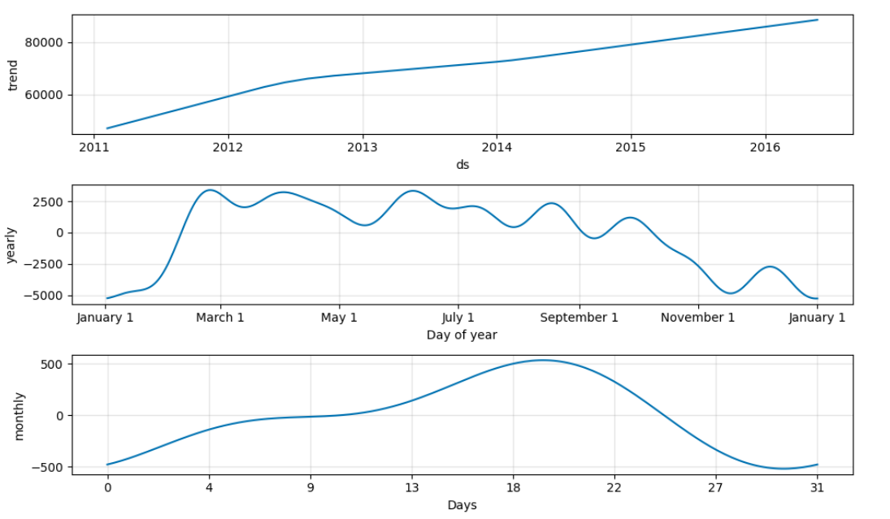
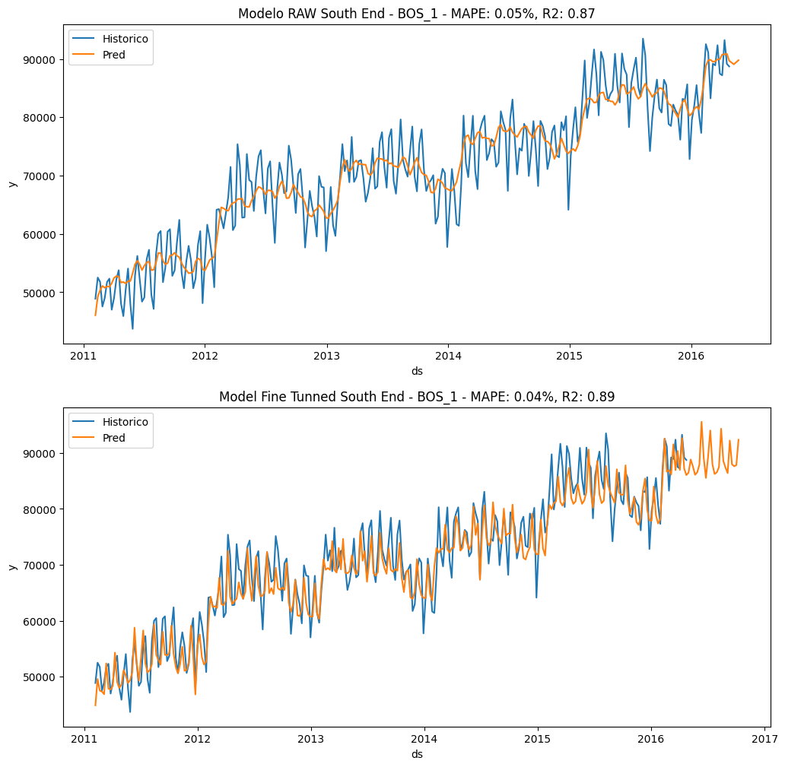

# Time Series - Prophet from Meta

## **1. Introducción**
Este nb forma parte del proyecto TFM del Master de Data Science & IA en Nuclio Digital School. Los datos consisten en una serie de observaciones sobre una 10 supermercados en la costa
oeste de EEUU. La tarea consiste en predecir a 4 semanas vista las ventas de los distintos productos.

## **2. Resumen operaciones y roadmap**

**1. Intro**: librerias y agrupacion de los datos por tienda
    
**2. Eventos**: Exploracion de distintos eventos que puedan tener impactos significativo en una cadena de supermercados de EEUUU. Inclusion de eventos comerciales(black friday, halloween, thanksgiving...), 
religiosos ( hannukah, diwali o ramadan) e incluso deportivos/diversos( marathon NY, NY pride).
    
**3. Modelaje con Prophet**: Primer intento de modelado, descomposicion temporal y extraccion de insights relevantes. Se hace a nivel tanto diario como a nivel semanal, siendo este mas adecuado.

    
**4. Optimizacion**: Inclusion de regresores, vacaciones nacionales y eventos seleccionados. Ajuste de hiperparametros con Optuna y cross-validation
    
**5. Resultados**: Tras el ajuste del modelo conseguimos que las predicciones se ajusten mas a la realidad consiguiendo capturar los maximos y minimos mejor.

**6. Aplicación práctica:**: Optimizacion del stock por tienda. 

